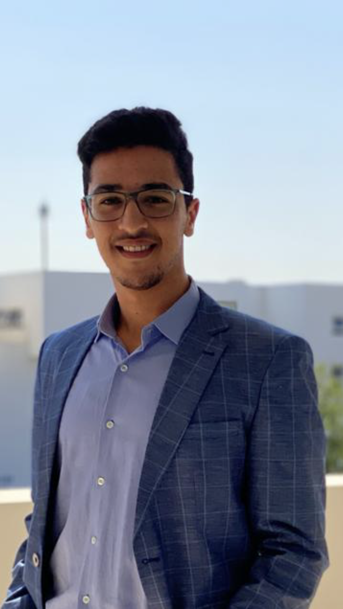

---
hide:
  - navigation
  - toc
title: About
---

<link rel="stylesheet" href="../../stylesheets/home/about.css">

  

    

     

     

      <h1>Ilyass El Fourati</h1>
      <h2>Nanterre (92000), France</h2>
      <h3>ML/AI Engineer | Centralien Engineer<h3>
      

       <a href="https://www.linkedin.com/in/ilyasselfourati" class="ln" style=" color: inherit;" title="LinkedIn - Ilyass El Fourati"><i class="fab fa-linkedin"></i></a>
       <a href="https://github.com/ilyasselfourati" class="git" style=" color: inherit;" title="Github - Ilyass El Fourati"><i class="fab fa-github"></i></a>
       <a href="mailto:<ilyasselfourati@gmail.com>" class="email" style=" color: inherit;" title="Email - ilyasselfourati@gmail.com"><i class="fas fa-paper-plane"></i></a>
      

     

    

  

  

    

     <a href="https://drive.google.com/file/d/13krKmGtHNq4Fo_SaLbYaMnN0Wvmz4VBq/view?usp=drive_link"><strong>Export Resume </strong><i class="far fa-file-alt"></i>
     </a><h1>About</h1>
      

      
<strong>Hello! I’m Ilyass El Fourati,</strong>  a Data Scientist and AI/ML Engineer, holding a degree from digitallab Centrale Marseille and currently pursuing studies at Ecole Centrale Casablanca while interning in my final year. With a deep-rooted belief in the transformative power of technology, I am driven by the prospect of leveraging data to instigate positive change. My passion lies in deploying data science methodologies to untangle intricate challenges and enact tangible enhancements in people's lives. I staunchly advocate for the ethos of hard work and unwavering dedication as fundamental cornerstones of achievement. Echoing the sentiments of celebrated author Stephen King, <strong>'Talent is cheaper than table salt. What separates the talented individual from the successful one is a lot of hard work.'</strong> Committed to perpetual learning and evolution, I am steadfast in my commitment to utilizing my expertise to effect significant advancements in the realm of data science.
     <h2><i class="fas fa-briefcase"></i> Experience -</h2>
     
<strong>Data Scientist Apr 2024 - Oct 2024 <a>Santarelli Group</a></strong> - Internship

      
<strong>𝐂𝐨𝐦𝐩𝐮𝐭𝐞𝐫 𝐕𝐢𝐬𝐢𝐨𝐧 𝐌𝐢𝐬𝐬𝐢𝐨𝐧𝐬:</strong>

     
<strong>Data Leader Mar 2023 - Sept 2023 <a>Forvia</a></strong> - Internship

     

      <ul>
        <li>Collect, analyze, and visualize data from internal software (ETL).
        <li>Implement data storage in a PostgreSQL database.
        <li>Design dynamic dashboards on Foundry (Palantir) to compare data from various sources.
        <li>Optimize an internal search engine by integrating semantics.
        <li>Implement summary models to shorten the length of texts in documents. (NLP)
        </li>
      </ul>
      
<strong>𝐃𝐚𝐭𝐚 𝐒𝐜𝐢𝐞𝐧𝐜𝐞 𝐌𝐢𝐬𝐬𝐢𝐨𝐧𝐬:</strong>

      <ul>
        <li>Designed the 𝐁𝐢𝐠 𝐃𝐚𝐭𝐚 𝐀𝐫𝐜𝐡𝐢𝐭𝐞𝐜𝐭𝐮𝐫𝐞 for the company, adopting the 𝐋𝐚𝐦𝐛𝐝𝐚 𝐀𝐫𝐜𝐡𝐢𝐭𝐞𝐜𝐭𝐮𝐫𝐞 𝐓𝐲𝐩𝐞 to ensure robustness and scalability.
        </li>
      </ul>
      
<i>𝑺𝒕𝒓𝒂𝒕𝒆𝒈𝒊𝒄𝒂𝒍𝒍𝒚 𝒎𝒂𝒑𝒑𝒆𝒅 𝒐𝒖𝒕:</i>

      <ul>
        <li>𝐃𝐚𝐭𝐚 𝐒𝐨𝐮𝐫𝐜𝐞𝐬 to capture diverse data streams.
        <li>𝐃𝐚𝐭𝐚 𝐒𝐭𝐨𝐫𝐚𝐠𝐞 solutions for efficient data management.
        <li>𝐁𝐚𝐭𝐜𝐡 𝐥𝐚𝐲𝐞𝐫, 𝐬𝐩𝐞𝐞𝐝 𝐥𝐚𝐲𝐞𝐫, 𝐚𝐧𝐝 𝐬𝐞𝐫𝐯𝐢𝐧𝐠 𝐥𝐚𝐲𝐞𝐫 for comprehensive data processing.
        <li>𝐃𝐚𝐭𝐚 𝐂𝐨𝐧𝐬𝐮𝐦𝐩𝐭𝐢𝐨𝐧 mechanisms to extract actionable insights.
        <li>Implemented 𝐁𝐢𝐠 𝐃𝐚𝐭𝐚 𝐆𝐨𝐯𝐞𝐫𝐧𝐚𝐧𝐜𝐞 measures to ensure data quality, security, and compliance.
        </li>
      </ul>
     
<strong>CEO and Founder Jan 2023 - Present <a href="https://abdellatif-belmady.github.io/smart-correction/">Smart Correction</a></strong> - Part Time

      
As the founder and CEO of Smart Correction, I have had the privilege of guiding this company from its exciting beginnings. Our mission at Smart Correction is to transform education by providing intelligent and personalized assistance to French and Moroccan students.

      <b>About Smart Correction:</b>
      
Smart Correction is more than just an educational platform. It is a vision, a revolution in learning powered by artificial intelligence. Our dedicated team has worked tirelessly to create an educational experience that transcends boundaries and opens new opportunities for every student.

      <b>Key Achievements:</b>
      <ul>
        <li>Successfully designed and launched the Smart Correction platform, offering instant assistance and accurate corrections.
        <li>Established strategic partnerships with educational institutions to integrate our solution into the educational landscape.
        <li>Implemented rigorous security measures to ensure user confidentiality.
        <li>Actively promoted smart and personalized education, with a commitment to continuous improvement.
        </li>
      </ul>
      <b>Impact on Education:</b>
      
Smart Correction has already touched the lives of thousands of students, helping them excel in their studies and prepare optimally for their exams. Our vision is to create a lasting impact on learning, making Smart Correction a benchmark in the field of smart education.

      
Join us in this educational adventure. Together, let's build a future where every student has access to quality, personalized, and effective education.

      <button><a href="https://youai.ai/ais/40eb0bac-eebf-4268-9e91-f5e75f6dcc79">Try It Now</a></button>
     
<strong>CEO and Founder Jan 2022 - Present <a href="https://www.linkedin.com/company/other-ways25/">Other Ways</a></strong> - Part Time

      
Today, the presence and installation of cameras are indispensable in large organizations and across various sectors. However, traditional camera systems often lag behind the advancements in the digital and intelligent world. At OtherWays, we offer a range of services leveraging intelligent cameras integrated with cutting-edge technologies. Our solutions go beyond traditional surveillance by providing advanced capabilities tailored to your needs, such as:
      <ul>
        <li>Collection and cleaning of invoices.
        <li>Extraction of precise data from scanned images using YOLOv7 and DocTR (OCR)
        <li>Detection and counting of people, enabling accurate footfall analysis and facilitating crowd control measures.
        <li>Development of a web application in Python with DASH, allowing for the upload of invoices and the automated generation of an Excel dataframe containing the extracted data.
        </li>
      </ul>
      <b>Libraries & techniques :</b> 
      🛠️Python : Numpy, Dash, Pandas, Sickit-learn, YOLOv7, Tensorflow, OCR, NER, NLP, Streamlit
      

      
<strong>DataFiab ProjectOct 2022 - Dec 2022 <a>Groupe ADF</strong></a> - Freelance

      
The aim of this project is to clean and standardize maintenance data collected from various sources, structure and store it in a database, apply machine learning (NLP) to the textual information, and visualize and highlight the stored data in Power BI.
      <ul>
        <li>Creation of a generalized pipeline to clean, standardize, and store CMMS (SAP) data from various companies using Pandas (Python) and MySQL.
        <li>Extraction of keywords from textual data using TF-IDF, RAKE, and TextRank.
        <li> Detection of themes using Topic Modeling algorithms (BERTopic, LDA, and NMF).
        <li>Comparison of models used for keyword and theme extraction using specific Natural Language Processing (NLP) metrics such as coherence and ROUGE.
        <li>Enhancing data accessibility and readability by creating visualizations such as Pareto charts, NLP algorithm results, failure reports, etc., in Power BI.
        </li>
      </ul>
      <b>Libraries & techniques :</b> 
      🛠️ Python : Numpy, NLP, Pandas, Sickit-learn, Gensim.
      🛠️Power BI : Power Query, DashBoards/Rapports, DAX.
      🛠️MySQL
      

      
<strong>Data Science Project Sept 2022 - Oct 2022 <a>6 PERFORM</strong></a> - Academic Project

      
In-depth study of the impact of COVID on the global economy : 

      <ul>
        <li>
        <li>Data collection, cleaning, analysis and visualisation.
        <li>Creation of a Dashboard (Dash/Plotly) to present the results.
        </li>
      </ul>Scientific Research ProjectOct 2021 - Jan 2022 <a>Ecole Centrale Casablanca</strong></a> - Academic Project

      <ul>
        <li>Collection of data from different satellites
        <li>Evaluation of remote sensing data for predicting extreme rainfall over Morocco.
        </li>
      </ul>
     <h2><i class="fas fa-graduation-cap"></i> Education -</h2>
      
<strong>Data ScienceSept 2022 - Sept 2023 <a>DigitalLab, Ecole Centrale Marseille</a></strong> France, Nice

      
 
      <strong> International exchangeFeb 2022 - Jul 2022 <a>Ecole Centrale Lille</a></strong> France, Lille
      

      
 
      <strong>Data Science and digitalizationSept 2020 - Oct 2024 <a href="http://www.centrale-casablanca.ma/fr/">Ecole Centrale Casablanca</a></strong> Morocco, Casablanca
      

      
<strong>Mathematics & Physics Engineering ScienceSept 2018 - Apr 2020 <a href="https://fabacademy.org/">Preparatory Classes Ibn Timiya</a></strong> Morocco, Marrakech

      

        
          

          
        
      

     <h2><i class="fas fa-headphones-alt"></i> What I'm Listening To -</h2>
      

       
    

  

